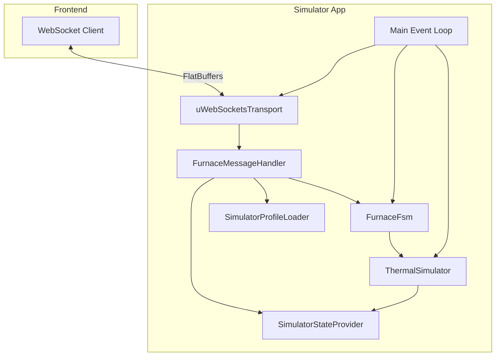

# C++ Simulator Application Plan

## Overview

Create a standalone C++ application at `firmware/simulator/` that simulates the furnace backend for frontend testing. It will use uWebSockets for the WebSocket server and integrate with the existing `HeatTreatFurnace` library.

**Source of Truth**:
- **Behavior**: Firmware FSM (`FurnaceFsm`, `Events.hpp`, state classes)
- **Protocol**: `proto/furnace.fbs` and `frontend/src/flatbuffers.ts`
- **Note**: The existing Node.js simulator is outdated and should NOT be used as reference

## Architecture



## Directory Structure

```
firmware/simulator/
├── CMakeLists.txt
├── src/
│   ├── main.cpp                    # Entry point, event loop
│   ├── uWebSocketsTransport.hpp    # ITransport implementation
│   ├── uWebSocketsTransport.cpp
│   ├── ThermalSimulator.hpp        # Thermal physics simulation
│   ├── ThermalSimulator.cpp
│   ├── SimulatorStateProvider.hpp  # IStateProvider implementation
│   ├── SimulatorStateProvider.cpp
│   ├── SimulatorProfileLoader.hpp  # IProfileLoader implementation
│   ├── SimulatorProfileLoader.cpp
│   └── SimulatorConfig.hpp         # Configuration constants
├── programs/                       # Sample program files (JSON)
│   └── test-program.json
└── README.md
```

## Key Components

### 1. uWebSocketsTransport (`src/uWebSocketsTransport.hpp`)

Implements `ITransport` using uWebSockets library:

- WebSocket server on configurable port (default 3000)
- Manages client connections with unique IDs
- Routes incoming binary messages to `IMessageHandler`
- Supports `Send()` to specific client and `Broadcast()` to all
- Provides `Poll()` method for event loop integration

### 2. ThermalSimulator (`src/ThermalSimulator.hpp`)

Physics simulation for temperature behavior:

- Implements `Heater::IHeaterController` interface (used by FSM)
- PID control for heat output (uses existing `Pid::PidController` from lib)
- Thermal model: `temp += (heatInput - heatLoss) * dt / thermalMass`
- Configurable parameters (sensible defaults, can be tuned):
  - `heaterPower`: 0.5 degC/sec at full power
  - `coolingCoefficient`: 0.0001 (Newton's cooling)
  - `thermalMass`: 100 (thermal inertia)
  - `ambientTemp`: 20.0 degC
- Case temperature derived from kiln temperature

**Note**: The Node.js simulator is outdated - this implementation uses the firmware FSM as the source of truth for behavior and the proto/frontend for the FlatBuffers protocol.

### 3. SimulatorStateProvider (`src/SimulatorStateProvider.hpp`)

Implements `IStateProvider`:

- Queries `FurnaceFsm` for mode and profile state
- Gets temperatures from `ThermalSimulator`
- Maps FSM `StateId` to FlatBuffers enum values
- Manages simulated time with configurable time scale (1x-100x)
- Sets `isSimulator = true` in state

### 4. SimulatorProfileLoader (`src/SimulatorProfileLoader.hpp`)

Implements `IProfileLoader`:

- Loads program JSON files from `programs/` directory
- Parses JSON format: `{ "segments": [{ "target": 100, "ramp_time": 10, "dwell_time": 5 }] }`
- Converts to `Furnace::Profile` struct

### 5. Main Event Loop (`src/main.cpp`)

```cpp
int main() {
    // Initialize components
    LogService logger(...);
    ThermalSimulator thermal(...);
    FurnaceFsm fsm(logger, thermal);
    SimulatorStateProvider stateProvider(fsm, thermal);
    SimulatorProfileLoader profileLoader("programs/");
    uWebSocketsTransport transport(3000);
    FurnaceMessageHandler handler(fsm, transport, stateProvider, profileLoader, logger);
    
    transport.SetMessageHandler(&handler);
    fsm.Init();
    
    // Event loop
    while (running) {
        transport.Poll();           // Process WebSocket events
        fsm.ProcessQueue();         // Process FSM events
        thermal.Update(deltaTime);  // Update thermal simulation
        handler.BroadcastState();   // Send state to clients
        sleep(tickInterval);
    }
}
```

## CMake Configuration

Based on `firmware/test-app/CMakeLists.txt`:

```cmake
cmake_minimum_required(VERSION 3.28.3)
project(furnace_simulator)

set(CMAKE_EXPORT_COMPILE_COMMANDS ON)
set(CMAKE_BUILD_TYPE Debug)

# uWebSockets dependency
FetchContent_Declare(
    uWebSockets
    GIT_REPOSITORY https://github.com/uNetworking/uWebSockets.git
    GIT_TAG v20.64.0
)
FetchContent_MakeAvailable(uWebSockets)

# Link HeatTreatFurnace library
add_subdirectory(../lib/HeatTreatFurnace HeatTreatFurnace)

add_executable(furnace_simulator
    src/main.cpp
    src/uWebSocketsTransport.cpp
    src/ThermalSimulator.cpp
    src/SimulatorStateProvider.cpp
    src/SimulatorProfileLoader.cpp
)

target_link_libraries(furnace_simulator
    HeatTreatFurnace
    uWebSockets
    z ssl crypto
)

set_target_properties(furnace_simulator PROPERTIES
    CXX_STANDARD 23
    CXX_STANDARD_REQUIRED ON
)
```

## Time Scaling

The simulator supports time acceleration for faster testing:

- Maintains simulated time separate from wall-clock time
- `SetTimeScaleCommand` adjusts scale (1.0x to 100.0x)
- All timestamps (`prog_start_ms`, `prog_end_ms`, `curr_time_ms`) use simulated time
- Thermal simulation advances by `realDeltaTime * timeScale`

## State Mapping

| FSM StateId | FlatBuffers Mode | FlatBuffers ProfileSubState |
|-------------|------------------|----------------------------|
| OFF | FurnaceMode_Off | ProfileSubState_None |
| ERROR | FurnaceMode_Error | ProfileSubState_None |
| PROFILE | FurnaceMode_Profile | ProfileSubState_None |
| PROFILE_LOADED | FurnaceMode_Profile | ProfileSubState_Loaded |
| PROFILE_RUNNING | FurnaceMode_Profile | ProfileSubState_Running |
| PROFILE_STOPPED | FurnaceMode_Profile | ProfileSubState_Stopped |
| PROFILE_COMPLETED | FurnaceMode_Profile | ProfileSubState_Completed |
| MANUAL | FurnaceMode_Manual | ProfileSubState_None |
| MANUAL_ON | FurnaceMode_Manual | (ManualSubState_On) |
| MANUAL_OFF | FurnaceMode_Manual | (ManualSubState_Off) |

## Testing

The simulator can be tested by:
1. Running `./furnace_simulator`
2. Connecting the frontend to `ws://localhost:3000/ws`
3. Using the existing frontend UI to control the simulated furnace

## Tasks

1. Create CMakeLists.txt with uWebSockets dependency and HeatTreatFurnace library link
2. Implement uWebSocketsTransport class implementing ITransport
3. Implement ThermalSimulator with PID control and thermal physics
4. Implement SimulatorStateProvider mapping FSM state to FlatBuffers
5. Implement SimulatorProfileLoader loading JSON program files
6. Create main.cpp with initialization and event loop
7. Create SimulatorConfig.hpp with thermal and timing constants
8. Create sample program JSON file for testing
9. Create README.md with build and usage instructions

## Future Enhancements (Out of Scope)

- History storage and retrieval
- Log file storage
- Program save/delete operations
- HTTP endpoints for firmware upload/reboot
