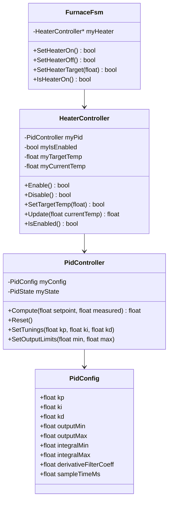

# PID Controller for Kiln Temperature Control

## Overview

Implement a PID controller optimized for a kiln with large thermal mass. The controller features anti-windup, derivative filtering, and output limiting. It integrates with the existing `FurnaceFsm` heater API.

## Architecture



## FurnaceFsm Expected API

The FSM calls these methods (currently stubs in `Furnace/FurnaceFsm.cpp`):

- `SetHeaterOn()` - Enable temperature control and heating
- `SetHeaterOff()` - Disable temperature control and heating  
- `SetHeaterTarget(float aTargetTemp)` - Set target temperature
- `IsHeaterOn() const` - Query if heater control is enabled

## PID Design for Large Thermal Mass Kilns

### Key Characteristics

- **Slow response**: Large thermal mass = long time constants (minutes to hours)
- **Overshoot sensitivity**: Once overshot, takes a long time to cool
- **Noise in temperature readings**: Thermocouples can be noisy

### Design Features

1. **Anti-Windup (Integral Clamping)**
   - Clamp integral term within configurable bounds
   - Prevents integral windup during long ramps or saturation

2. **Derivative Filtering**
   - Low-pass filter on derivative term to reduce noise amplification
   - Configurable filter coefficient (typical: 0.1-0.2)

3. **Output Limiting**
   - Configurable min/max output (0-100% for duty cycle)
   - Prevents actuator saturation

4. **Sample Time Consistency**
   - Fixed sample time for consistent behavior
   - Typical for kilns: 1-5 seconds

5. **Conservative Default Tunings**
   - Lower gains to prevent overshoot
   - Suggested starting point: Kp=2.0, Ki=0.01, Kd=50.0

## File Structure

```
firmware/lib/HeatTreatFurnace/
├── Pid/
│   ├── PidController.hpp      # PID algorithm with anti-windup and filtering
│   ├── PidController.cpp
│   ├── PidConfig.hpp          # Configuration struct
│   ├── PidState.hpp           # Internal state struct
│   └── PLAN.md                # This plan document
├── Heater/
│   ├── HeaterController.hpp   # Refactored heater with PID integration
│   ├── HeaterController.cpp
│   ├── Heater.hpp             # (deprecated or removed)
│   └── Heater.cpp             # (deprecated or removed)
```

## Key Implementation Details

### PidController Class

```cpp
namespace HeatTreatFurnace::Pid
{
    class PidController
    {
    public:
        explicit PidController(const PidConfig& aConfig);
        
        float Compute(float aSetpoint, float aMeasured);
        void Reset();
        void SetTunings(float aKp, float aKi, float aKd);
        void SetOutputLimits(float aMin, float aMax);
        void SetIntegralLimits(float aMin, float aMax);
        
    private:
        PidConfig myConfig;
        PidState myState;
        
        float PrivApplyDerivativeFilter(float aRawDerivative);
        float PrivClamp(float aValue, float aMin, float aMax);
    };
}
```

### HeaterController Class

```cpp
namespace HeatTreatFurnace::Heater
{
    class HeaterController
    {
    public:
        explicit HeaterController(Log::LogService& aLogger);
        
        bool Enable();
        bool Disable();
        bool SetTargetTemp(float aTemp);
        bool IsEnabled() const;
        
        // Called periodically to compute PID output
        float Update(float aCurrentTemp);
        float GetOutput() const;
        float GetTargetTemp() const;
        
    private:
        Pid::PidController myPid;
        float myTargetTemp;
        float myOutput;
        bool myIsEnabled;
    };
}
```

### FurnaceFsm Integration

Modify `FurnaceFsm` to hold a `HeaterController` reference and delegate heater methods:

```cpp
// In FurnaceFsm constructor - inject HeaterController
FurnaceFsm(Log::LogService& aLogger, Heater::HeaterController& aHeater);

// Delegate methods
bool FurnaceFsm::SetHeaterOn() { return myHeater.Enable(); }
bool FurnaceFsm::SetHeaterOff() { return myHeater.Disable(); }
bool FurnaceFsm::SetHeaterTarget(float aTemp) { return myHeater.SetTargetTemp(aTemp); }
bool FurnaceFsm::IsHeaterOn() const { return myHeater.IsEnabled(); }
```

## Tuning Recommendations for Kilns

| Parameter | Suggested Range | Notes |
|-----------|-----------------|-------|
| Kp | 1.0 - 5.0 | Lower values prevent overshoot |
| Ki | 0.001 - 0.05 | Very low for slow systems |
| Kd | 20.0 - 100.0 | Higher for large thermal mass |
| Sample Time | 1000-5000ms | Slower sample for slow dynamics |
| Derivative Filter | 0.1 - 0.3 | Filters noise without lag |

## Testing Strategy

1. **Unit tests** for `PidController` computation accuracy
2. **Unit tests** for anti-windup behavior
3. **Unit tests** for `HeaterController` state machine (enable/disable)
4. **Integration tests** with `FurnaceFsm` to verify API contracts

## Implementation Steps

1. [x] Create Pid/ subdirectory and PLAN.md file
2. [x] Implement PidConfig.hpp configuration struct
3. [x] Implement PidState.hpp internal state struct
4. [x] Implement PidController.hpp/.cpp with anti-windup and derivative filtering
5. [x] Implement HeaterController.hpp/.cpp integrating PidController
6. [x] Modify FurnaceFsm to use HeaterController via dependency injection
7. [x] Write unit tests for PidController and HeaterController
